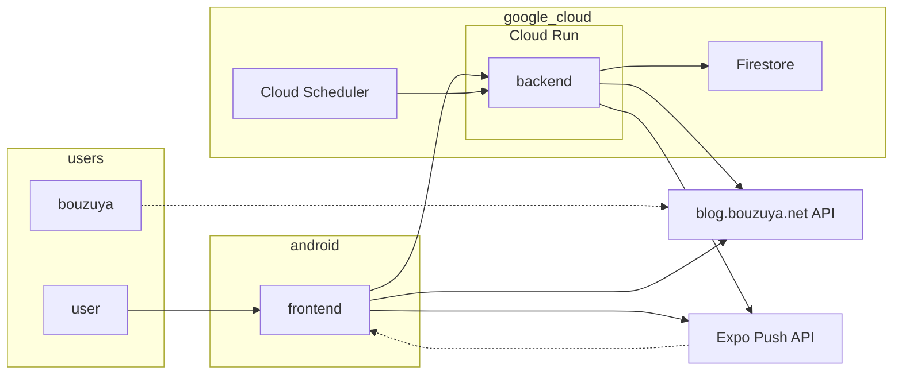
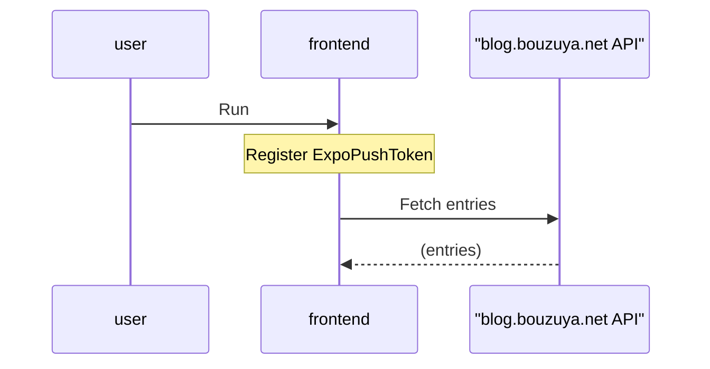
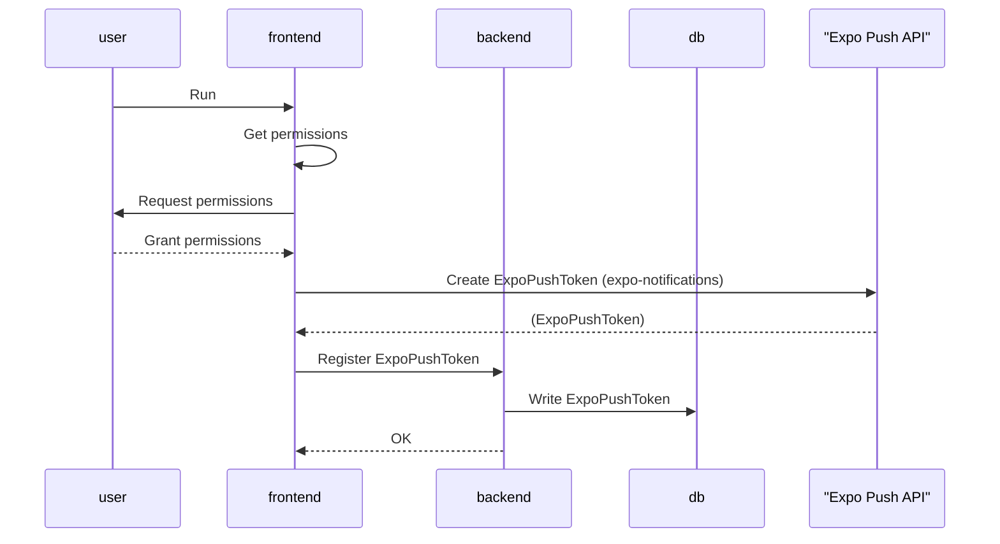
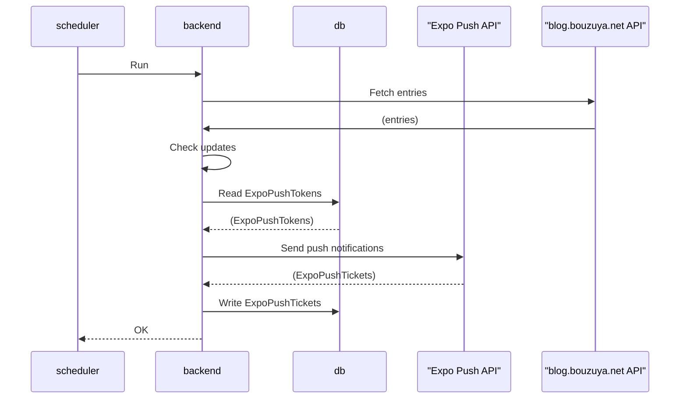
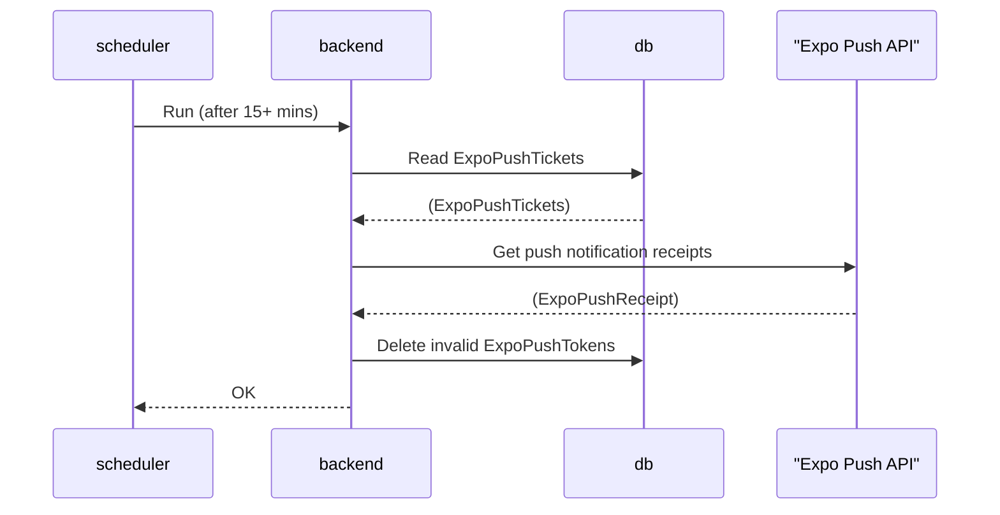

# bbna: blog.bouzuya.net for Android

blog.bouzuya.net for Android.

<https://play.google.com/store/apps/details?id=net.bouzuya.blog>

## System Architecture Diagram

## UseCases

### Fetch entries

### Register ExpoPushToken

### Send push notifications

### Delete invalid ExpoPushTokens

